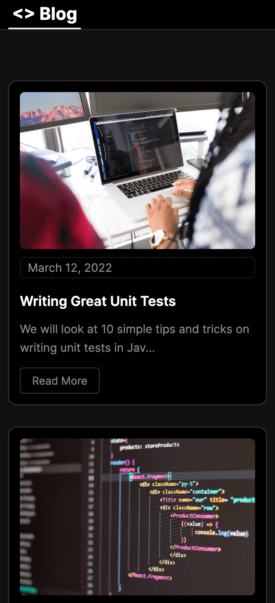

# Next.js Markdown Blog

A Next.js markdown blog static site generator (SSG)

> Note: This project is built with the Next.js Pages Router, to see how to create a Markdown Blog with the Next.js App Router check the [next-markdown-blog-app-router](https://github.com/emanuelefavero/next-markdown-blog-app-router) repository

## Live Demo

- [https://next-markdown-blog-ivory.vercel.app/](https://next-markdown-blog-ivory.vercel.app/)

#### Screenshot



## How to use

### Installation

- clone the repo and `cd` into it, then run:

```bash
npm install
```

### Development

- run the development server:

```bash
npm run dev
```

## How to create new posts

- create a new markdown file in the `posts` directory
- add the following front-matter to the top of the file:

```markdown
---
title: 'My New Post'
date: 'Jan 29 2023'
excerpt: 'This is my new post'
cover_image: '/images/posts/my-new-post-cover-image.jpg'
---
```

- add the content of your post below the front-matter in markdown format

> Note: add a cover image in the `public/images/posts` directory and reference it in the front-matter

## Test Static Site Generation

- run the build command:

```bash
npm run build
```

- install serve:

```bash
npm install -g serve
```

- run the static site:

```bash
serve -s out -p 8000
```

## Used Packages

- [marked](https://www.npmjs.com/package/marked) - Markdown parser for creating Blog posts from markdown files
- [gray-matter](https://www.npmjs.com/package/gray-matter) - a front-matter parser for parsing metadata at the top of files

## License

- [MIT](LICENSE.md)
